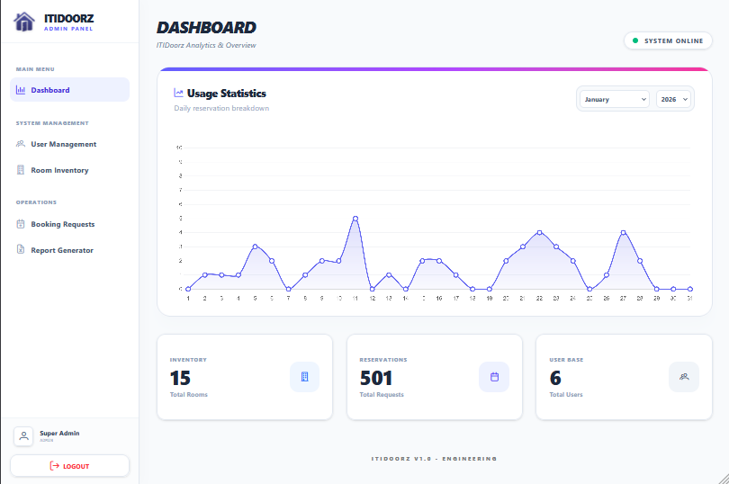
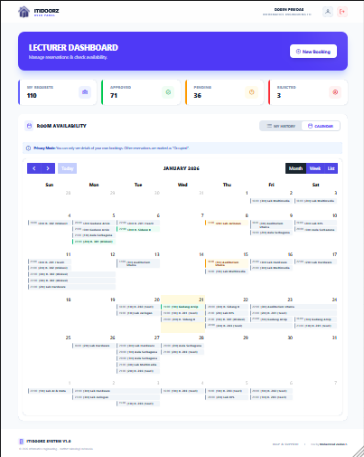
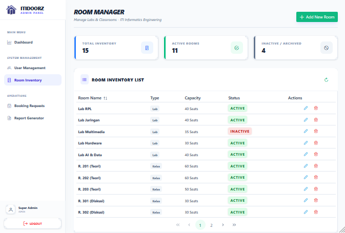
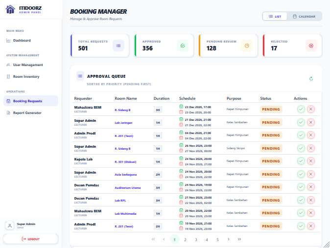
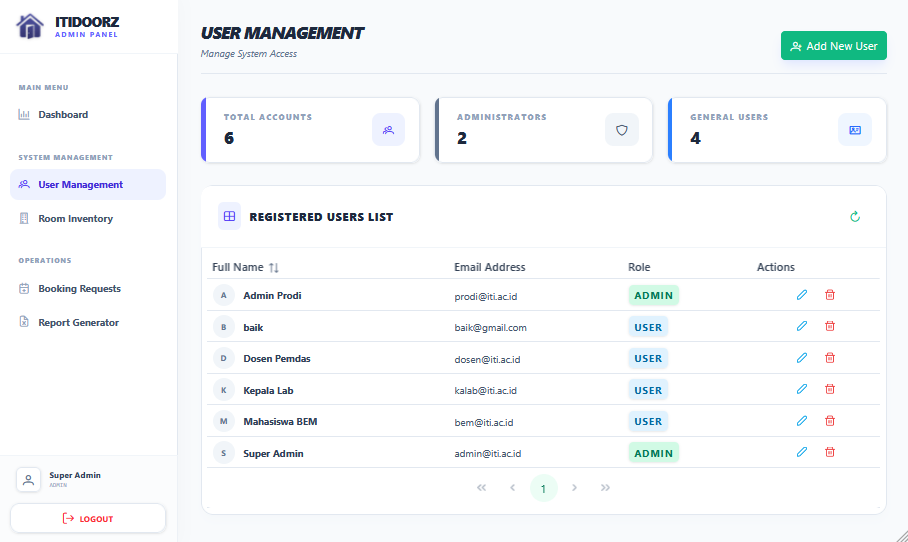

# 🚪 ITIDoorz - Campus Facility Booking System


**ITIDoorz** is a modern, full-stack web application designed to streamline the scheduling and management of classrooms and laboratories at **Institut Teknologi Indonesia (ITI)**.

Built to solve scheduling conflicts, it empowers students and lecturers to easily book facilities while providing administrators with powerful tools for oversight, approval workflows, and usage reporting.

---

## 🛠️ Tech Stack

Engineered with performance and scalability in mind using industry-standard technologies.

### Backend (Server-side)

- **Language:** [Go (Golang)](https://go.dev/) - Chosen for high performance and concurrency.
- **Framework:** [Gin Gonic](https://gin-gonic.com/) - Fast HTTP web framework.
- **Database:** MySQL - Relational data management.
- **ORM/Driver:** SQLX - Secure and efficient database extensions.
- **Security:** JWT (JSON Web Tokens) & Bcrypt for secure authentication.
- **Documentation:** Swagger (Swaggo) - Interactive API docs.

### Frontend (Client-side)

- **Framework:** [Vue.js 3](https://vuejs.org/) (Composition API) - For a reactive user interface.
- **Styling:** Tailwind CSS - Utility-first CSS for rapid, responsive design.
- **State Management:** Vue Reactivity API.
- **Visualization:** Chart.js - Data visualization for admin analytics.
- **HTTP Client:** Axios - For seamless API integration.
- **Calendar:** [FullCalendar](https://fullcalendar.io/) - Interactive scheduling interface.

---

## ✨ Key Features

### 🛡️ Admin Dashboard (The Control Center)

- **Visual Analytics:** Monthly room usage statistics visualized with interactive charts.
- **Inventory Control:** Complete CRUD (Create, Read, Update, Delete) for room management.
- **User Management:** Administer accounts for Admins and Users with secure role-based access.
- **Approval Workflow:** Review incoming booking requests and take action (**Approve** or **Reject**) instantly.
- **Schedule Calendar:** Interactive calendar view to monitor room occupancy and manage schedules across days, weeks, or months.
- **Report Generator:** Export detailed usage reports to **CSV** & **JSON** for offline analysis.

### 👤 User Panel (Lecturers & Staff)

- **Real-time Catalog:** Browse available rooms with capacity and facility details.
- **Availability Calendar:** Check room availability via an interactive calendar to find open slots easily.
- **Instant Booking:** Submit reservation requests with specific dates and times.
- **Status Tracking:** Monitor the status of booking requests (Pending/Approved/Rejected).

### 🎨 UX/UI Excellence

- **📱 Mobile-First Design:** Optimized for touchscreens. Stat cards stack vertically on mobile and expand on desktop.
- **🍔 Adaptive Navigation:** Features a drawer menu on mobile and a sticky sidebar on desktop screens.
- **⚡ Reactive Feedback:** Instant form validation, loading states, and toast notifications for user actions.

---

## 🚀 Installation & Setup

Follow these steps to run the project locally.

### Prerequisites

- Go 1.20+
- Node.js & npm
- MySQL Server

### 1. Clone the Repository

```bash
git clone [https://github.com/MuhammadZaidan1/booking-system-go-vue.git](https://github.com/MuhammadZaidan1/booking-system-go-vue.git)
cd booking-system-go-vue
```

### 2. Database Setup

1. Open your MySQL client (phpMyAdmin, Workbench, or Terminal).
2. Create a new database named `itidoorz_db` (or whatever you prefer).
3. Import the SQL schema file located in `/database/itidoorz.sql` (if available) or run the migration script.

### 3. Backend Configuration (Go)

Navigate to the backend directory and set up the environment variables.

```bash
cd backend
go mod tidy
cp .env.example .env
```

**Run the Server:**

```bash
go run main.go
```

### 4. Frontend Setup (Vue.js)

Open a new terminal and navigate to the frontend directory.

```bash
cd frontend-go
npm install
npm run dev
```

The application should now be running at `http://localhost:5173` (or the port shown in your terminal).

---

## 📚 API Documentation

Once the backend is running, you can access the Swagger documentation to explore the API endpoints:

* **URL:** `http://localhost:8080/swagger/index.html`

---

## 📸 Application Preview

|                  User Dashboard                  |                  Admin Dashboard                   |
| :----------------------------------------------: | :------------------------------------------------: |
|  |  |

|                  Room Management                   |                    Booking-Management                    |
| :------------------------------------------------: | :------------------------------------------------------: |
|  |  |

|                 Login Page                  |                  User Management                   |
| :-----------------------------------------: | :------------------------------------------------: |
|  |  |

|                   Report Generator                   |           Mobile Responsive View           |
| :--------------------------------------------------: | :----------------------------------------: |
|  |  |
